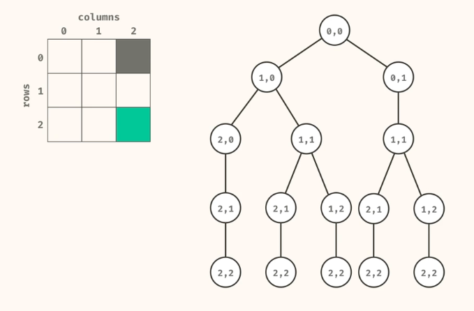

# countPaths Function

## Description

The `countPaths` function computes the number of unique paths from the top-left corner to the bottom-right corner of a grid. In this grid, 'X' represents walls that cannot be passed through, and 'O' represents open spaces where movement is allowed. The function allows movement only to the right or downward.

## Function

```javascript
const countPaths = (grid, r = 0, c = 0, memo = {}) => {
  const pos = r + ',' + c;
  if (pos in memo) return memo[pos];

  const inBounds = r >= 0 && r < grid.length && c >= 0 && c < grid[0].length;
  const finalPos = r === grid.length - 1 && c === grid[0].length - 1;

  if (finalPos && grid[r][c] !== 'X') return 1;
  if (!inBounds || grid[r][c] === 'X') return 0;

  memo[pos] =
    countPaths(grid, r + 1, c, memo) + countPaths(grid, r, c + 1, memo);
  return memo[pos];
};
```

## Parameters

- `grid` (Array of Arrays): A 2D array where each element is either 'X' (wall) or 'O' (open space).
- `r` (Number): The current row index. Default is 0.
- `c` (Number): The current column index. Default is 0.
- `memo` (Object): An object for memoization to store results of subproblems. Default is an empty object.

## Returns

- `Number`: The number of unique paths from the top-left corner to the bottom-right corner of the grid.

## Example

```javascript
const grid = [
  ['O', 'O', 'X'],
  ['O', 'O', 'O'],
  ['O', 'O', 'O'],
];
console.log(countPaths(grid)); // Output: 5
```

<div style="display:flex;">
  
</div>

## Explanation

1. **Memoization Check:** If the result for the current position (`r, c`) is already computed and stored in `memo`, return the stored result.
2. **Bounds and Walls Check:** Check if the current position is within the bounds of the grid and is not a wall.
3. **Destination Check:** If the current position is the bottom-right corner and is not a wall, return 1 (indicating a valid path).
4. **Recursive Calculation:** Compute the number of paths by moving downwards and to the right, store the result in `memo`, and return the result.

## Time Complexity

The time complexity of this function is O(m \* n), where `m` is the number of rows and `n` is the number of columns in the grid. Each cell is visited at most once due to memoization.

## Space Complexity

The space complexity of this function is O(m \* n) due to the memoization storage and the call stack. The `memo` object stores results for each cell, and the maximum depth of the recursion stack is equal to the sum of the grid's dimensions.
